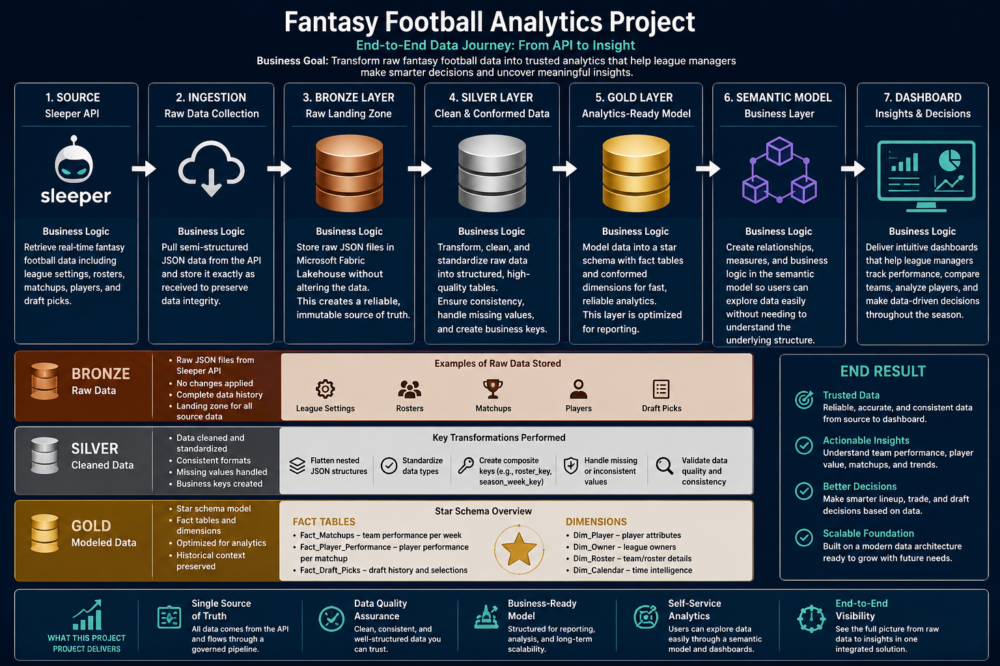

# End-to-End Data Architecture

This project demonstrates an end-to-end analytics engineering solution built on Microsoft Fabric using data from the Sleeper Fantasy Football API. The goal is to transform raw, semi-structured API data into a trusted analytical model that supports interactive reporting and business decision-making.

## Project Flow

The architecture follows a **Medallion (Bronze → Silver → Gold)** design pattern:

* **Bronze Layer** – Raw JSON data is retrieved from the Sleeper API using Python and stored in the Microsoft Fabric Lakehouse with minimal transformation, preserving the original source data.
* **Silver Layer** – Raw data is cleaned, standardized, and transformed into Delta tables. Business keys are created, nested JSON is flattened, and dimensional modeling is applied to produce high-quality analytical datasets.
* **Gold Layer** – A Power BI semantic model is built using a star schema consisting of fact and dimension tables. Measures, relationships, and business logic are applied to create a trusted reporting layer for analytics and visualization.

## Technologies Used

* Microsoft Fabric Lakehouse
* Python (Pandas)
* REST API Integration
* Delta Lake
* Dimensional Modeling (Star Schema)
* Power BI Semantic Model
* Git & GitHub

The diagram below illustrates how data flows through each layer—from raw API ingestion to a production-ready analytics dashboard.

